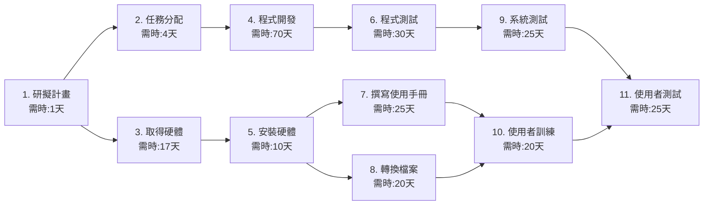
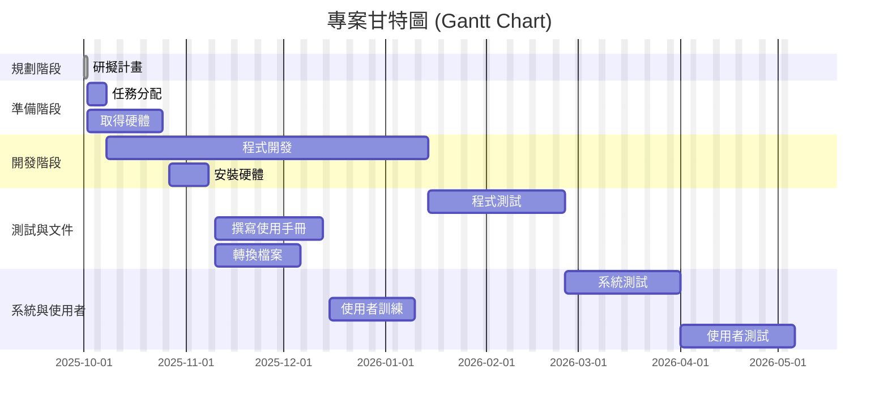
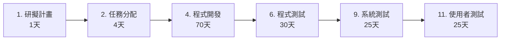

### PERT / CPM 圖

```mermaid
graph LR

A1[1. 研擬計畫<br>需時:1天] --> A2[2. 任務分配<br>需時:4天]
A1 --> A3[3. 取得硬體<br>需時:17天]
A2 --> A4[4. 程式開發<br>需時:70天]
A3 --> A5[5. 安裝硬體<br>需時:10天]
A4 --> A6[6. 程式測試<br>需時:30天]
A5 --> A7[7. 撰寫使用手冊<br>需時:25天]
A5 --> A8[8. 轉換檔案<br>需時:20天]
A6 --> A9[9. 系統測試<br>需時:25天]
A7 --> A10[10. 使用者訓練<br>需時:20天]
A8 --> A10
A9 --> A11[11. 使用者測試<br>需時:25天]
A10 --> A11
```

### 甘特圖

```mermaid
gantt
    dateFormat  YYYY-MM-DD
    title 專案甘特圖 (Gantt Chart)
    excludes weekends

    section 規劃階段
    研擬計畫           :done, a1, 2025-10-01, 1d

    section 準備階段
    任務分配           :a2, after a1, 4d
    取得硬體           :a3, after a1, 17d

    section 開發階段
    程式開發           :a4, after a2, 70d
    安裝硬體           :a5, after a3, 10d

    section 測試與文件
    程式測試           :a6, after a4, 30d
    撰寫使用手冊       :a7, after a5, 25d
    轉換檔案           :a8, after a5, 20d

    section 系統與使用者
    系統測試           :a9, after a6, 25d
    使用者訓練         :a10, after a7 a8, 20d
    使用者測試         :a11, after a9 a10, 25d
```

### 關鍵路徑

```mermaid
graph LR
A1[1. 研擬計畫<br>1天] --> A2[2. 任務分配<br>4天]
A2 --> A4[4. 程式開發<br>70天]
A4 --> A6[6. 程式測試<br>30天]
A6 --> A9[9. 系統測試<br>25天]
A9 --> A11[11. 使用者測試<br>25天]
```
