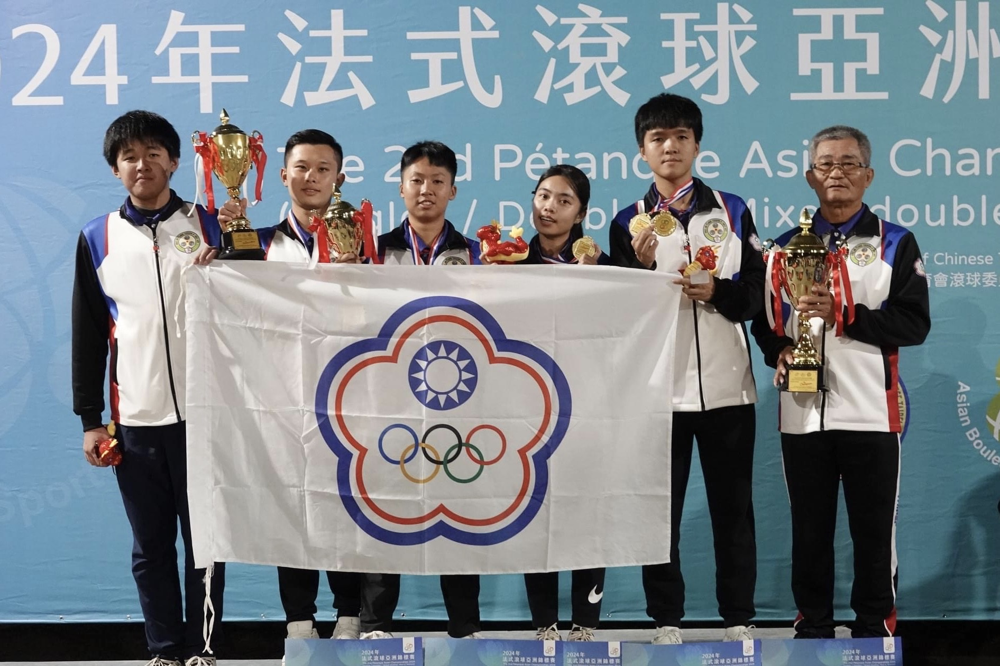

# 籃姿雅

## 關於我

專長
* 技能一：法式滾球
* 技能二：法式滾球
* 技能三：法式滾球

**法式滾球**

*You may be disappointed if you fail, but you are doomed if you don't try.*

加入一個你最喜歡的網站連結
[YouTube](https://www.youtube.com/)

插入一張圖片

>Success is walking from failure to failure with no loss of enthusiasm. -Winston Churchill

>Growth and comfort do not coexist.“ -Ginni Rometty

建立一個包含你的教育背景或工作經驗的表格，至少兩列兩行。

加入一個程式碼區塊，展示你學過的一小段程式碼 (Python語言，例如 print("Hello, Markdown!"))。

